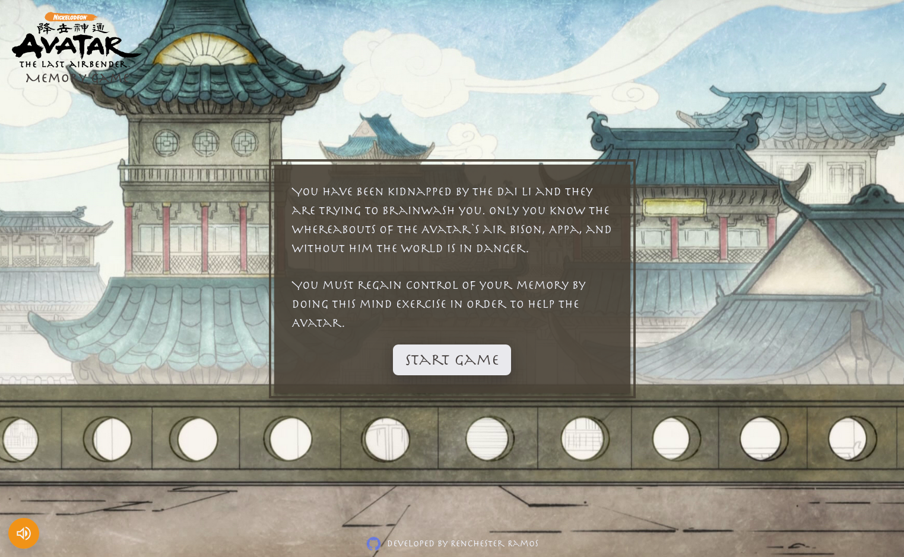
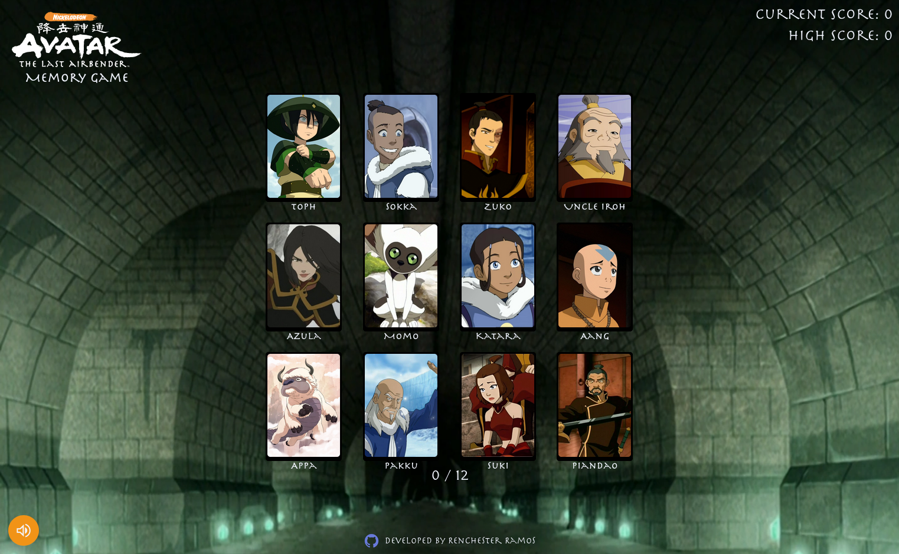
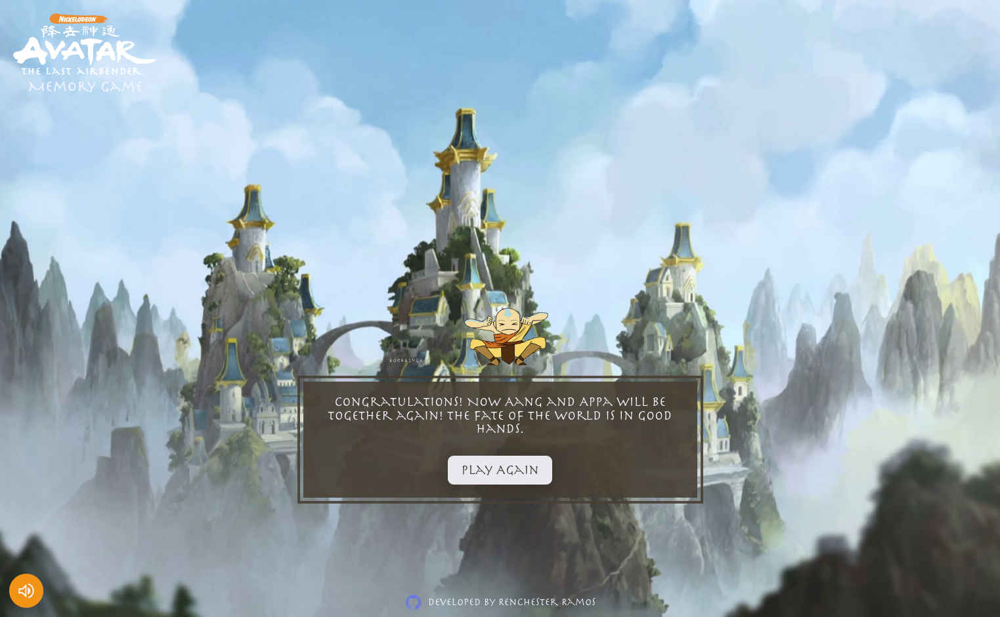

## The Odin Project

# Project: Memory Game

**Live version** of the site can be found [here](https://renchester.github.io/memory-game/)

The Avatar: The Last Airbender Memory Card Game is a fun game to test your memory skills while immersing you in the world of the beloved animated series.

### Gameplay

You play as a character captured by the Dai Li under Lake Laogai. Only you know where to find Appa, the Avatar's air bison, and the Avatar needs your help. In order to prevent the Dai Li from brainwashing you, you must successfully pick all the cards presented to you.

The game consists of a deck of cards featuring characters from the show. The cards are shuffled and placed face down on the playing area. Picking a card that has already been picked beforehand results in a loss. The game continues until all the cards have been matched.

### Built With

- Vite + React
- Framer Motion
- Sass
- HTML5

### Getting Started

In order to setup and work on this project on your own, you will need to:

1. Clone this project:  
   `git clone https://github.com/renchester/memory-game.git`

2. Once you have cloned this project, you can install the required dependencies by using:  
   `npm install`

3. A live demo of the project can be started by using:  
   `npm run preview`

4. Distribution files can be produced using:  
   `npm run build`

### Credits/Acknowledgments

This project is for personal use only. I do not own the rights to any of the assets used in this project. The background images used in this app are from Nickelodeon's The Legend of Korra. All character images and music are courtesy of Nickelodeon's Avatar: The Last Airbender.

Music used (composed by Jeremy Zuckerman and Benjamin Wynn):

1. End Credits
2. Dai Li
3. Tsungi Horn
4. Avatar Theme Song (Opening Sequence)

### Deployment

Deployed on [GitHub Pages](https://pages.github.com/)

### Display

Start Screen

Game Screen

Win Screen

---

Developed by **Renchester Ramos**
